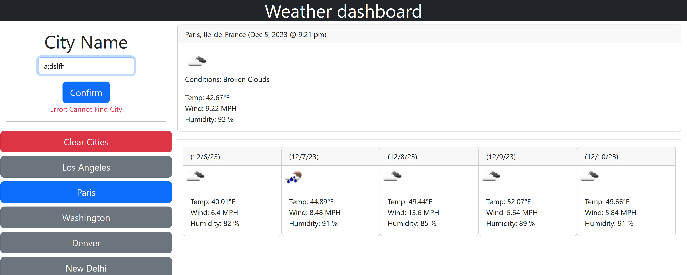

# Weather Tracker [](https://opensource.org/licenses/MIT)

This project is designed to be a weather tracker. It saves your previously searched for cities and gives you both the current and future weather conditions. 

Technologies Used:
1. HTML
2. CSS
3. JavaScript
4. jQuery
5. OpenWeather API
6. Bootstrap
7. Local Storage
8. GitHub
9. GitHub Pages

## User Story

```
AS A traveler
I WANT to see the weather outlook for multiple cities
SO THAT I can plan a trip accordingly
```

## Usage

This site should be used to find and compare weather data across various cities around the world.
<!-- Edit Link -->
The site can be accessed here: https://hudsonpepper.github.io/Weather-Tracker/
<!-- Add Screenshot of final product -->
Example Screenshot of End-card of the Quiz:



## Credits

This code is an original project inspired from course materials from the EdX Fullstack Web Development Bootcamp in collaboration with UPenn.  

## License
MIT License

Copyright (c) 2023 hudsonpepper

Permission is hereby granted, free of charge, to any person obtaining a copy
of this software and associated documentation files (the "Software"), to deal
in the Software without restriction, including without limitation the rights
to use, copy, modify, merge, publish, distribute, sublicense, and/or sell
copies of the Software, and to permit persons to whom the Software is
furnished to do so, subject to the following conditions:

The above copyright notice and this permission notice shall be included in all
copies or substantial portions of the Software.

THE SOFTWARE IS PROVIDED "AS IS", WITHOUT WARRANTY OF ANY KIND, EXPRESS OR
IMPLIED, INCLUDING BUT NOT LIMITED TO THE WARRANTIES OF MERCHANTABILITY,
FITNESS FOR A PARTICULAR PURPOSE AND NONINFRINGEMENT. IN NO EVENT SHALL THE
AUTHORS OR COPYRIGHT HOLDERS BE LIABLE FOR ANY CLAIM, DAMAGES OR OTHER
LIABILITY, WHETHER IN AN ACTION OF CONTRACT, TORT OR OTHERWISE, ARISING FROM,
OUT OF OR IN CONNECTION WITH THE SOFTWARE OR THE USE OR OTHER DEALINGS IN THE
SOFTWARE.